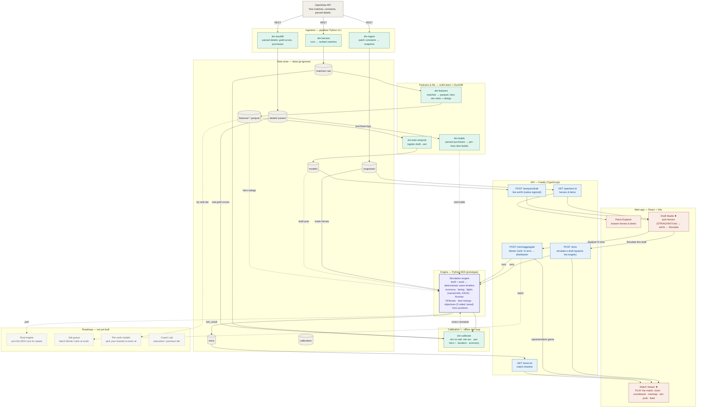

# DraftMaster — system design

> How a drafted Dota 2 match becomes a **watchable simulation**.
>
> Real ranked match data flows in from OpenDota, trains a draft→win model and
> grounds a deterministic simulation engine, an offline loop calibrates that
> engine against reality, and the results are served through an API to a React
> web app. Pick a draft in the browser and watch the game it produces unfold
> minute-by-minute — a *generated* match, not a replay.

This is the developer-facing map of the whole system — every component, **built
or planned**, and how data moves between them. Dashed nodes in the flowchart are
the roadmap (documented on purpose, not yet built).

---

## End-to-end flowchart

**Legend** — 🟩 Python pipeline · 🟪 engine / sim core · 🟦 API (TypeScript) ·
🟧 web (React) · ⬜ data / external · ◌ dashed = planned (not yet built) ·
★ the core draft → watch loop.

---

## How to read it: the flows that matter

1. **Three ingestion paths, one store.** `dm-ingest` pulls *patch constants* (the
   snapshot powering Patch Explorer and Draft Studio). `dm-harvest` banks *raw
   ranked matches* (the training corpus). `dm-backfill` fetches *parsed match
   details* (per-minute gold curves + purchase logs) for a sample — the ground
   truth the economy is calibrated against.
2. **The core loop is draft → watch.** Draft Studio posts a draft to `POST /sims`,
   which spawns the engine to simulate *that* game; the Match Viewer opens playing
   it. Draft → predict (win%) → simulate → watch, end to end.
3. **The model and ratings loop back into the engine.** The win-prob model seeds
   the engine's *draft prior* (a stronger draft starts ahead), and data-derived
   *hero ratings* make a simulated Anti-Mage differ from a simulated Invoker.
4. **Calibration is a feedback loop, not a serving path.** `dm-calibrate` sims
   real drafts offline and scores four things — win accuracy, per-hero win-rate
   correlation, game duration, and economy checkpoints against parsed details —
   and that result is how the engine's constants get tuned. It never touches the
   API.

---

## Design decisions

| Decision | Choice | Why |
|---|---|---|
| Simulation fidelity | **Macro** discrete-event sim (30s ticks), not micro/unit-level | A believable *watchable* game needs beats and economy, not pathfinding; a complete coarse loop beats a perfect fragment. |
| Engine language (now) | **Python** prototype | Fastest path to a correct, calibrated loop; sits next to the data/ML that feeds it. |
| Engine language (later) | **Rust** port (planned) | Speed for Monte-Carlo (thousands of sims per draft); same seam, same timeline contract. |
| Determinism | Single seeded RNG; same draft+seed ⇒ byte-identical timeline | Reproducibility, golden-replay tests, and a stable thing to calibrate. |
| Presentational state (positions, K/D/A) | **rng-free**, pure functions of game state | Adding a scoreboard or moving dots can never change a match outcome. |
| Data source | **OpenDota** free tier | No cost, rich enough (drafts, outcomes, parsed gold/purchase logs). |
| Scope of data | **Ranked All Draft only**; all rank tiers banked | Educational tool for real play; keeping every bracket enables future "pick your rank" models. |
| Win prediction in the API | Native `sigmoid(intercept + weights·draft)` in TS | The logistic model exports coefficients — no ONNX/sklearn runtime in the API. |
| Engine's real target | **Distributional realism** (per-hero r, duration, economy), not winner accuracy | Draft-only info caps win accuracy; the engine's job is believable dynamics. The Draft Studio uses the model for win%. |
| Storage | Files under `data/` (Parquet/JSON), DuckDB for queries | Zero infra for a solo alpha; a database is a deploy-time concern. |

Longer rationale for the load-bearing calls lives in
[docs/decisions/](docs/decisions/).

---

## Component inventory

| Component | Layer | Tech | Status | Where |
|---|---|---|---|---|
| OpenDota API | External | — | external | opendota.com |
| `dm-ingest` | Ingestion | Python | ✅ built | `pipeline/dm_pipeline/ingest/` |
| `dm-harvest` | Ingestion | Python | ✅ built | `pipeline/dm_pipeline/harvest/daemon.py` |
| `dm-backfill` | Ingestion | Python | ✅ built | `pipeline/dm_pipeline/harvest/backfill.py` |
| `dm-features` | Features &amp; ML | Python · DuckDB | ✅ built | `pipeline/dm_pipeline/features/` |
| `dm-train-winprob` | Features &amp; ML | Python · scikit-learn | ✅ built | `pipeline/dm_pipeline/models/win_probability/` |
| Simulation engine | Engine | Python (DES) | ✅ built | `pipeline/dm_pipeline/prototype/` |
| `dm-calibrate` | Calibration | Python | ✅ built | `pipeline/dm_pipeline/calibrate/` |
| Patch Data API | API | TypeScript · Fastify | ✅ built | `api/src/routes/patches.ts` |
| Sims API (`GET`) | API | TypeScript · Fastify | ✅ built | `api/src/routes/simulations.ts` |
| Simulate-a-draft (`POST /sims`) | API | TypeScript · Fastify | ✅ built | `api/src/routes/simulations.ts` + `simRunner.ts` |
| Monte Carlo (`POST /sims/aggregate`) | API + Engine | TS · Fastify + Python | ✅ built | `simulations.ts` + `prototype/montecarlo.py` (`dm-montecarlo`) |
| Draft eval API | API | TypeScript · Fastify | ✅ built | `api/src/routes/analysis.ts` |
| Patch Explorer | Web | React · Vite | ✅ built | `web/src/pages/PatchExplorer.tsx` |
| Draft Studio | Web | React · Vite | ✅ built | `web/src/pages/DraftStudio/` |
| Match Viewer (playback) | Web | React · Vite | ✅ built | `web/src/pages/MatchViewer/` |
| Minimap w/ moving heroes | Web | React (SVG) | ✅ built | `web/src/pages/MatchViewer/Minimap.tsx` |
| Rust engine | Engine | Rust | ⬜ planned | `engine/` |
| Job queue (batch Monte Carlo) | Backend | — | ⬜ planned | — *(on-demand aggregation is built; queue is for scale)* |
| Per-rank models | ML | Python | ⬜ planned | — |
| Item-timing beats | Engine + Web | Python + React | ✅ built | `dm-builds` + `_item_tick` + feed/scoreboard |
| Coach Lab | Web | — | ⬜ planned | `web/src/pages/CoachLab/` *(placeholder)* |

> Some `web/src/pages/` and `api/src/routes/` entries (e.g. `Learn`, `PatchDiff`,
> `SimDashboard`, `replays.ts`, `scenarios.ts`) are scaffolded placeholders, not
> yet wired into the live flow.

---

## Repository layout

| Path | Role |
|---|---|
| `pipeline/` | Python: ingestion, harvesting, feature store, ML models, **the simulation engine**, calibration |
| `api/` | TypeScript / Fastify API: snapshots, sims (read + simulate), draft eval |
| `web/` | React + Vite frontend (Patch Explorer, Draft Studio, Match Viewer) |
| `schemas/` | JSON Schema data contracts (see [docs/02-data-model.md](docs/02-data-model.md)) |
| `data/` | Generated artifacts (snapshots, matches, details, features, models, sims, calibration) — **git-ignored** |
| `engine/` | Rust simulation core — **planned, not started** |
| `infra/`, `docs/` | Deployment scaffolding and documentation |

---

## Build stages

Stage 0 (design) → Stage 8 (launch). Full task lists and exit criteria in
[docs/01-implementation-pipeline.md](docs/01-implementation-pipeline.md).

| Stage | Name | Status |
|---|---|---|
| 0 | System design | ✅ done |
| 1 | Feasibility spikes | ✅ draft→win signal proven |
| 2 | Data foundation | ✅ snapshots + auto-harvesting 100k+ ranked corpus + parsed details |
| 3 | Engine core | ✅ full watchable game (real economy, fights/K/D/A, Roshan, levels, item timings, 2-sided objectives, positions); ⬜ Rust port |
| 4 | Orchestrator / API | 🟡 API + draft eval + simulate-a-draft + **Monte-Carlo aggregate**; ⬜ job queue (batch scale) |
| 5 | Frontend | ✅ Draft Studio + Match Viewer playback (scoreboard, minimap, win-prob, feed) |
| 6 | ML &amp; calibration | 🟡 feature store, win-prob model, four-metric calibration harness; ⬜ per-rank / fight-outcome models |
| 7 | Coach Lab / education | ⬜ not started |
| 8 | Beta &amp; launch | ⬜ not started (personal project — no ship planned yet) |
