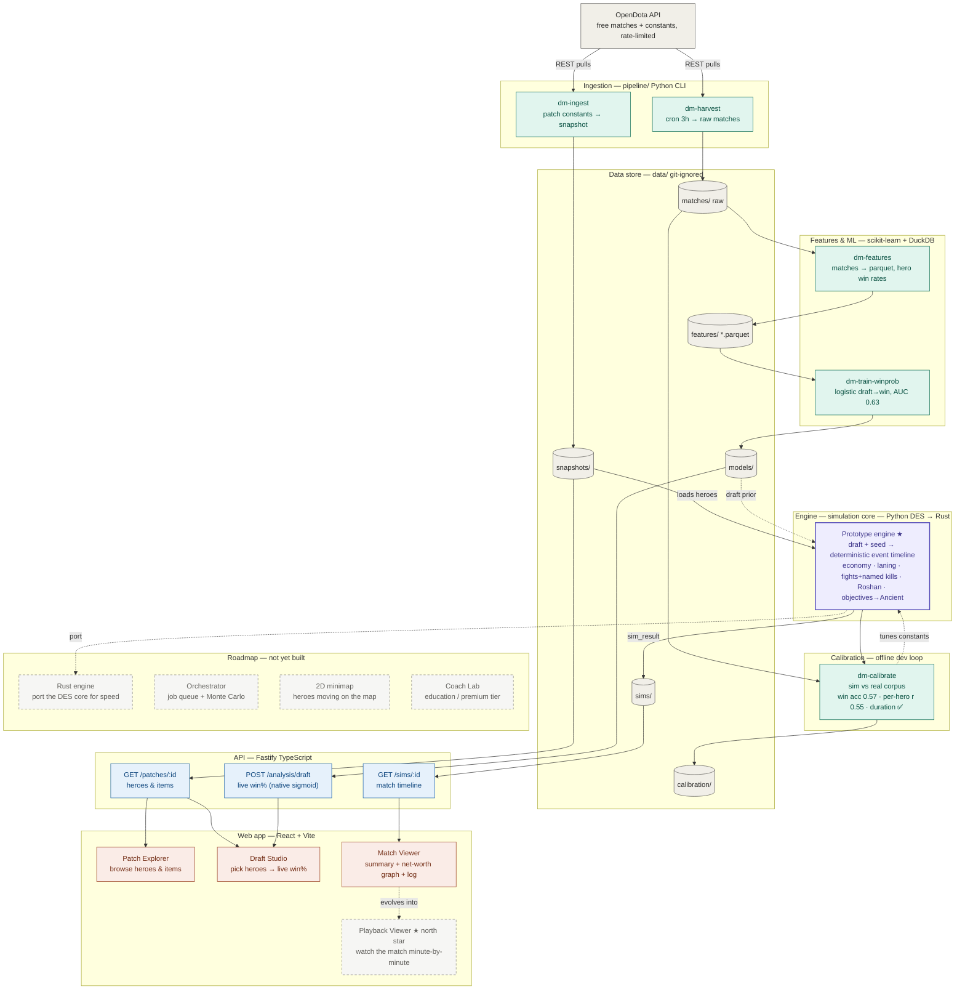

# DraftMaster — system design

> How a real Dota 2 match becomes a **watchable simulation**.
>
> DraftMaster is a Football-Manager-style match simulator. Real match data flows
> in from OpenDota, trains a draft→win model and grounds a deterministic
> simulation engine, an offline loop calibrates that engine against reality, and
> the results are served through an API to a React web app. The **north star** is
> the Playback Viewer — watching a *generated* match unfold minute-by-minute (a
> simulation, not a replay).

This document is the developer-facing map of the whole system — every component,
**built or planned**, and how data moves between them. Read the flowchart
top-to-bottom; the dashed nodes are the roadmap.

---

## End-to-end flowchart

**Legend** — 🟩 Python pipeline · 🟪 engine / sim core · 🟦 API (TypeScript) ·
🟧 web (React) · ⬜ data / external · ◌ dashed = planned (not yet built).

---

## How to read it: the three flows that matter

1. **Two ingestion paths, one store.** `dm-ingest` pulls *patch constants* (the
   snapshot that powers Patch Explorer and Draft Studio). `dm-harvest` runs on a
   cron banking *raw matches* (the training corpus). They serve different purposes
   but both land in `data/`.
2. **The model loops back into the engine** (the `draft prior` edge). The
   win-probability model isn't only for the Draft Studio bar — its coefficients
   seed the engine's *draft prior*, so a stronger draft starts the simulated match
   ahead.
3. **Calibration is a feedback loop, not a serving path** (the `tunes constants`
   edge). `dm-calibrate` sims real drafts offline, scores realism (per-hero win-rate
   correlation, game duration), and that result is how the engine's constants get
   tuned. It never touches the API.

The **★ Playback Viewer** is the north star. The diagram makes the punchline
visible: everything upstream already exists to feed it — the engine emits a rich
event timeline; it simply isn't *animated* yet.

---

## Component inventory

| Component | Layer | Tech | Status | Where |
|---|---|---|---|---|
| OpenDota API | External | — | external | opendota.com |
| `dm-ingest` | Ingestion | Python | ✅ built | `pipeline/dm_pipeline/ingest/` |
| `dm-harvest` | Ingestion | Python | ✅ built | `pipeline/dm_pipeline/harvest/` |
| `dm-features` | Features &amp; ML | Python · DuckDB | ✅ built | `pipeline/dm_pipeline/features/` |
| `dm-train-winprob` | Features &amp; ML | Python · scikit-learn | ✅ built | `pipeline/dm_pipeline/models/win_probability/` |
| Prototype engine | Engine | Python (DES) | ✅ built | `pipeline/dm_pipeline/prototype/` |
| `dm-calibrate` | Calibration | Python | ✅ built | `pipeline/dm_pipeline/calibrate/` |
| Patch Data API | API | TypeScript · Fastify | ✅ built | `api/src/routes/patches.ts` |
| Sims API | API | TypeScript · Fastify | ✅ built | `api/src/routes/simulations.ts` |
| Draft eval API | API | TypeScript · Fastify | ✅ built | `api/src/routes/analysis.ts` |
| Patch Explorer | Web | React · Vite | ✅ built | `web/src/pages/PatchExplorer.tsx` |
| Draft Studio | Web | React · Vite | ✅ built | `web/src/pages/DraftStudio/` |
| Match Viewer | Web | React · Vite | ✅ built | `web/src/pages/MatchViewer/` |
| Playback Viewer | Web | React · Vite | ⬜ planned | — *(north star)* |
| Rust engine | Engine | Rust | ⬜ planned | `engine/` |
| Orchestrator | Backend | — | ⬜ planned | — *(job queue + Monte Carlo)* |
| 2D minimap | Web | React | ⬜ planned | — |
| Coach Lab | Web | — | ⬜ planned | `web/src/pages/CoachLab/` *(placeholder)* |

> Some `web/src/pages/` and `api/src/routes/` entries (e.g. `Learn`, `PatchDiff`,
> `SimDashboard`, `replays.ts`, `scenarios.ts`) are scaffolded placeholders, not
> yet wired into the live flow above.

---

## Repository layout

| Path | Role |
|---|---|
| `pipeline/` | Python: ingestion, harvesting, feature store, ML models, the prototype engine, calibration |
| `engine/` | Rust simulation core — **not started** (the prototype engine will be ported here) |
| `api/` | TypeScript / Fastify read-only API serving snapshots, sims, and draft eval |
| `web/` | React + Vite frontend (Patch Explorer, Draft Studio, Match Viewer) |
| `schemas/` | JSON Schema single-source-of-truth + SQL migrations |
| `data/` | Generated artifacts (snapshots, matches, features, models, sims) — **git-ignored** |
| `infra/`, `docs/` | Deployment and documentation scaffolding |

---

## Build stages

The build follows a staged pipeline (Stage 0 design → Stage 8 launch):

| Stage | Name | Status |
|---|---|---|
| 0 | System design | ✅ done |
| 1 | Feasibility spikes | ✅ draft→win model proven (AUC 0.63) |
| 2 | Data foundation | ✅ snapshots + API + auto-harvesting corpus |
| 3 | Engine core | 🟡 prototype is a real game (towers→Ancient, Roshan, named kills); not ported to Rust |
| 4 | Orchestrator / API | 🟡 read-only API + draft eval; no job queue / Monte Carlo |
| 5 | Frontend alpha | 🟡 Patch Explorer + Match Viewer + Draft Studio; no playback / minimap |
| 6 | ML &amp; calibration | 🟡 feature store, win-prob model, realism calibration loop |
| 7 | Coach Lab / education | ⬜ not started |
| 8 | Beta &amp; launch | ⬜ not started |
